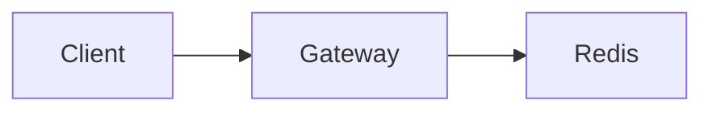

# Live Plan primitives

Fenced blocks are YAML. The fence language is the block type (`phase`, `callout`, `choice`, `form`, `questions`, `approve`, `checklist`, `workflow`). Anything outside those fences is markdown. A `mermaid` fence is markdown: it is drawn on the Plan tab, not on the Workflow tab.

`live-plan wait <id>` prints one interaction response as JSON. `live-plan review` prints the review result.

## Frontmatter

```yaml
---
title: Rate limiting rollout
summary: One sentence a person can scan.
agent: local-cursor
mode: watch
---
```

`mode` is `watch` or `review`. The CLI command (`serve` vs `review`) selects the server mode; frontmatter `mode` is recorded on the parsed plan.

## phase

Status timeline. Use one block per major step. Set exactly one phase to `active` while work is underway.

`status`: `pending` | `active` | `blocked` | `done` | `failed`. Unknown values become `pending`.

`id` defaults to a slug of `title`.

```phase
id: implement
title: Implement gateway middleware
status: active
body: |
  Wire the limiter into the request path. Default the flag to off.
```

## callout

`kind`: `note` | `tip` | `risk` | `decision` | `warning`. Unknown values become `note`.

```callout
kind: risk
title: Redis dependency
body: |
  A Redis outage must not take down the API.
```

## choice

The human picks one option. `wait` prints:

```json
{ "kind": "choice", "id": "fail-mode", "optionId": "open", "label": "Fail open" }
```

```choice
id: fail-mode
prompt: If Redis is unreachable, how should the limiter behave?
options:
  - id: open
    label: Fail open
    description: Allow traffic if Redis is down.
  - id: closed
    label: Fail closed
    description: Reject traffic if Redis is down.
```

Give every option an `id`. `description` is optional.

## form

`field.type`: `text` | `number` | `textarea` | `select`. Anything else becomes `text`.

`select` needs `options` (strings). `default` is a string or number. `placeholder` is optional.

`wait` prints values keyed by `name`. `number` fields come back as numbers; other types come back as strings.

```json
{
  "kind": "form",
  "id": "limits",
  "values": { "max_rps": 120, "window_s": 60, "rollout": "5" }
}
```

```form
id: limits
prompt: Set the initial production limits
fields:
  - name: max_rps
    label: Max requests per window
    type: number
    required: true
    default: 120
  - name: rollout
    label: Initial rollout percentage
    type: select
    required: true
    options: ["1", "5", "25", "100"]
    default: "5"
```

`name` is the key in `values`. Do not rename it after the form is on screen.

## questions

One free-text answer per item. Answer keys are the item index as a string (`"0"`, `"1"`, …), in the order written under `items`.

`wait` prints:

```json
{
  "kind": "questions",
  "id": "rollout-notes",
  "answers": {
    "0": "staging, then production",
    "1": "Extend the existing gateway dashboard"
  }
}
```

```questions
id: rollout-notes
prompt: Anything else before coding?
items:
  - Which environments should receive the flag first?
  - Is there an existing dashboard to extend?
```

`prompt` is optional. `id` is required in practice so `wait` has a stable target (it otherwise slugs from `prompt` or `"questions"`).

## approve

Yes/no gate. `wait` prints:

```json
{ "kind": "approve", "id": "proceed-implement", "approved": true, "note": "Ship behind the flag" }
```

`note` is omitted when the human leaves it blank.

```approve
id: proceed-implement
prompt: Proceed with implementation using the answers above?
body: |
  Phase statuses in this file will update as the work proceeds.
```

## checklist

Not an interaction. You flip `done` as you finish. A bare string is an open item.

```checklist
title: Done when
items:
  - text: Middleware behind a flag
    done: false
  - text: 429 + Retry-After covered by tests
    done: true
```

## workflow

Expected execution plan. The Workflow tab draws it before the run starts. Each node `ref` is the plan block id a click jumps to. `ref` defaults to `id` when that block exists. Give phases, callouts, and checklist items ids when a node should point at them.

Omit the block and the diagram follows phases and gates in document order. A plan with neither shows the sample graph until a live graph is pushed.

```workflow
id: rollout
title: Expected execution
nodes:
  - id: design
    ref: design
    label: Confirm limiter design
  - id: implement
    ref: implement
    label: Implement gateway middleware
edges:
  - from: design
    to: implement
  - from: implement
    to: implement
    label: retry
```

An edge may point at its own node. That self-loop is drawn as an arc, with optional `label`. To close a loop through another card, set `fromSide` and `toSide` (`top`, `right`, `bottom`, or `left`) so the return edge does not sit on the forward path. Optional node fields: `detail`, `status`, `x`, `y`.

## mermaid

A diagram in the plan itself. The fence language is `mermaid`. The Plan tab draws it. The Workflow tab does not use this fence.

Put the fence in the plan markdown:

````markdown

````

The same fence works in a phase, callout, or approve `body`. Indent it under `body: |` so the inner fence does not close the outer block:

````markdown
```phase
id: design
title: Confirm limiter design
status: active
body: |
  ```mermaid
  flowchart LR
    Gateway --> Redis
  ```
```
````

Other fenced code stays as code. A diagram that cannot be parsed stays as source with a short error under it.

## review result

`live-plan review` prints this and exits `0` approve, `1` deny, `2` iterate, `3` timeout:

```json
{
  "decision": "iterate",
  "note": "Drop the 100% rollout option",
  "comments": [],
  "responses": [],
  "iteration": 1
}
```

`responses` is every interaction answered during that server process, in submission order. `iteration` is the `--iteration` you passed.

## execution graph

`execution start` and `execution push` accept `--graph` (preferred) and optional `--scene`.

```json
{
  "nodes": [
    {
      "id": "design",
      "label": "Confirm design",
      "detail": "Fail-open chosen",
      "status": "done",
      "x": 40,
      "y": 80
    },
    {
      "id": "implement",
      "label": "Implement middleware",
      "status": "active",
      "x": 320,
      "y": 80
    }
  ],
  "edges": [
    { "from": "design", "to": "implement" },
    { "from": "implement", "to": "design", "label": "retry", "fromSide": "bottom", "toSide": "bottom" }
  ]
}
```

Node `status`: `pending` | `active` | `blocked` | `done` | `failed`. `detail`, `x`, and `y` are optional. Reuse the plan block id so the live overlay keeps the plan reference. `fromSide` and `toSide` are `top`, `right`, `bottom`, or `left`.

`execution push` keeps the current `step`, `detail`, `graph`, and `scene` when you omit that flag. `execution stop` sets `active` to false and leaves the last graph on screen. Plan interactions stay locked until execution is stopped.
